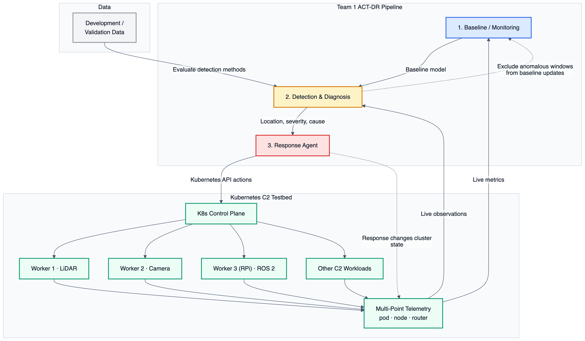
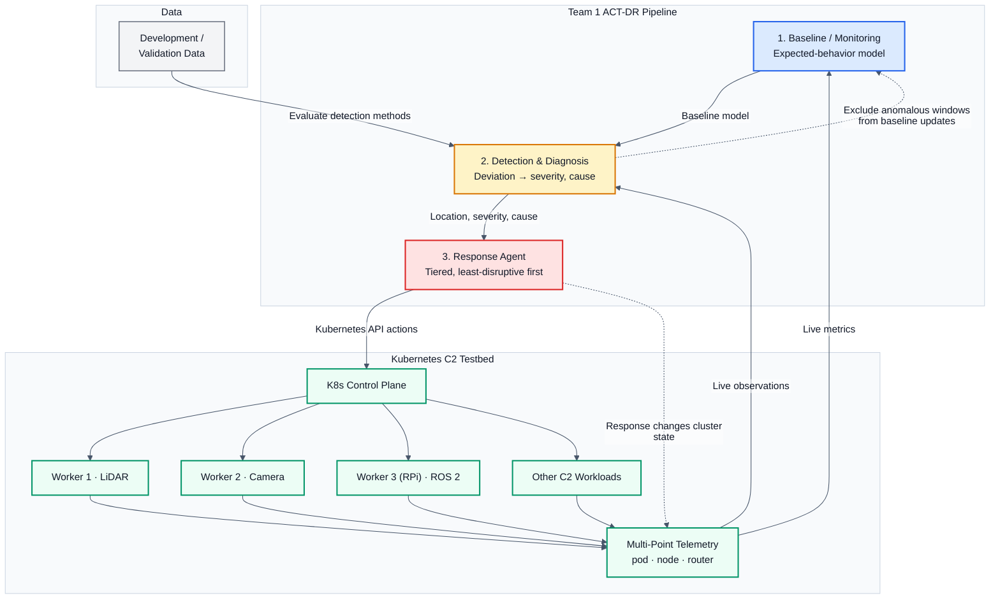

```mermaid
%%{init: {"theme": "base", "flowchart": {"htmlLabels": false}, "themeVariables": {"fontFamily": "Helvetica, Arial", "fontSize": "15px", "primaryTextColor": "#111827", "secondaryTextColor": "#111827", "tertiaryTextColor": "#111827", "lineColor": "#475569", "edgeLabelBackground": "#ffffff", "clusterBkg": "#f8fafc", "clusterBorder": "#cbd5e1"}}}%%
flowchart TB

    subgraph PIPE["Team 1 ACT-DR Pipeline"]
        direction LR
        B["1. Baseline / Monitoring<br/>Expected-behavior model"]
        DD["2. Detection &amp; Diagnosis<br/>Deviation → severity, cause"]
        R["3. Response Agent<br/>Tiered, least-disruptive first"]
        B -->|"Baseline model"| DD
        DD -->|"Location, severity, cause"| R
    end

    subgraph K8S["Kubernetes C2 Testbed"]
        CP["K8s Control Plane"]
        W1["Worker 1 · LiDAR"]
        W2["Worker 2 · Camera"]
        W3["Worker 3 (RPi) · ROS 2"]
        OT["Other C2 Workloads"]
        TEL["Multi-Point Telemetry<br/>pod · node · router"]

        CP --> W1 & W2 & W3 & OT
        W1 & W2 & W3 & OT --> TEL
    end

    subgraph DATA["Data"]
        D1["Development /<br/>Validation Data"]
    end

    D1 -->|"Evaluate detection methods"| DD
    TEL -->|"Live metrics"| B
    TEL -->|"Live observations"| DD
    R -->|"Kubernetes API actions"| CP
    R -.->|"Response changes cluster state"| TEL
    DD -.->|"Exclude anomalous windows<br/>from baseline updates"| B

    classDef baseline fill:#dbeafe,stroke:#2563eb,color:#111827,stroke-width:2px;
    classDef detection fill:#fef3c7,stroke:#d97706,color:#111827,stroke-width:2px;
    classDef response fill:#fee2e2,stroke:#dc2626,color:#111827,stroke-width:2px;
    classDef k8snode fill:#ecfdf5,stroke:#059669,color:#111827,stroke-width:2px;
    classDef data fill:#f3f4f6,stroke:#6b7280,color:#111827,stroke-width:1.5px;

    class B baseline;
    class DD detection;
    class R response;
    class CP,W1,W2,W3,OT,TEL k8snode;
    class D1 data;
```
